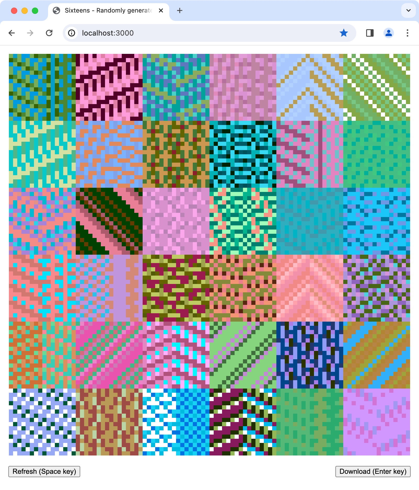

# Sixteens

## About

Randomly generated 16x16 icons.

Press enter key to download the icons. Press space key for a fresh set of icons.



## Getting Started

- Open index.html in a browser
- Make any changes in src/sketch.js
- Refresh the page in the browser

You can use query params to change the size and quantity of rendered icons. The defaults are:

- `?iconSize=16&iconCount=6&scaleFactor=8`

## How It Works

Icons are represented as nested arrays, with each item indicating a "pixel" colour.

A 3x3 icon could be:

```js
const icon = [
  [0, 2, 1],
  [2, 1, 0],
  [1, 0, 2],
];
```

Icons are built row by row, with each new row being a transform of the previous row.

To create an icon, first:

- Generate a random colour palette with `n` colours
- Select a random "row transform strategy" from the available strategies

Then:

- Create an array for the first row
- Fill the row with random integers between `0` and `n`, each representing a colour from the palette
- Copy the row and apply the selected transform to it. This gives you the next row
- Repeat until all rows have been created

## Credits

Thanks to:

- [p5.js](https://github.com/processing/p5.js)
- [ColorMaker](https://github.com/julienlabat/colormaker) for the palettes
- this article https://www.freecodecamp.org/news/how-to-create-generative-art-in-less-than-100-lines-of-code-d37f379859f/
